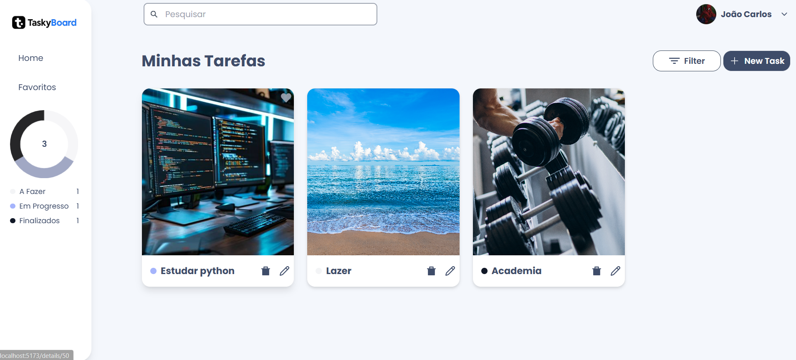
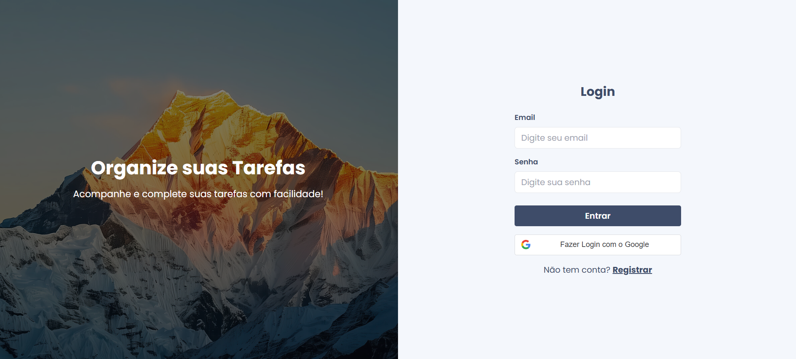

<h1 align="center" style="font-weight: bold;">📝 Task Manager App</h1>  

<p align="center">  
  <a href="#tech">Tecnologias</a> •   
  <a href="#start">Como rodar</a> •   
  <a href="#structure">Arquitetura</a> •  
  <a href="#contrib">Contribuindo</a> 
</p>  

<p align="center"><b>Gerencie suas tarefas com organização, filtros e favoritos.</b></p>  

<p align="center">     
  <a href="https://taskyboard-psi.vercel.app/">📱 Acesse o projeto</a> 
</p>

---

## 🎨 Layout

<p align="center">     
    
   
</p>

---

## 🏗️ Arquitetura <a id="structure"></a>

O projeto é dividido em duas partes:

### 📦 Aplicações

* **`Front-end/`** – Frontend em React + Vite + Tailwind
* **`Back-end/`** – Backend em Node.js + Express + PostgreSQL

---

## 📋 Pré-requisitos

* **Node.js** >= 18
* **Docker** e **Docker Compose**
* **Git**

---

## 🚀 Como rodar o projeto <a id="start"></a>

### 1. Clone o repositório

```bash
git clone <url-do-repo>
cd Projectjs
```

### 2. Suba os serviços com Docker

```bash
docker-compose up -d
```

> Isso iniciará o PostgreSQL e deixará o banco acessível na porta `5432`.

#### Setup automático (Recomendado)
```bash
# Na raiz do projeto
npm setup:env
```
Este comando irá copiar os arquivos `.env.example` para `.env` em todas as aplicações.

#### Setup manual
Se preferir configurar manualmente, crie arquivos `.env` em cada aplicação:
```bash
cd Back-end
copy .env.example .env
cd ../Front-end
copy .env.example .env
```

## 📝 Comandos úteis de Migrations

```bash
npm run migrate   # Cria as tabelas
npm run seed      # Insere dados nas tabelas
npm run undo      # Desfaz a última migration
npm run reset     # Reseta todas as migrations
```

### 3. Configure o backend

```bash
cd Back-end
cp .env.example .env
npm install
npm run migrate       # Executa as migrations no banco
npm run dev           # Inicia o servidor backend (porta 3000)
```

### 4. Configure o frontend

```bash
cd Front-end
npm install
npm run dev           # Inicia o app React (porta 5173)
```

---

## 💻 Tecnologias utilizadas <a id="tech"></a>

### 🖥️ Frontend

* React
* Vite
* TailwindCSS
* React Router DOM
* Axios
* Context API
* chartJS
* zod
* React Hook Form

### 🛠️ Backend

* Node.js
* Express
* MySQL
* Sequelize
* JWT e oauth (autenticação)
* multer e aws s3
* nodemailer
* MVC
* API Restfull
* zod

### 🐳 Infra

* Docker
* Docker Compose
* aws(CloudWatch, SNS, IAM, S3)

---

## 📁 Estrutura do Projeto

```
ProjectJS/
├── Back-end/              # Aplicação Frontend
├── Front-end/              # API Backend
├── docker-compose.yml   # Configuração do back-end e banco de dados
└── README.md
```

---

## 🔐 Funcionalidades

* Login e Registro de usuários com JWT e oauth(google)
* Cadastro, edição e exclusão de tarefas
* Filtro por status (A fazer, Em progresso, Finalizado)
* Marcar/desmarcar favoritos
* Mensagens de feedback (Flash messages)
* Responsividade
* upload de arquivos para usuários e tarefas
* envio de email ao se cadastrar no sistema
* tema dark e light
* dashboard para análise dos status das tarefas
* Edição de sua conta
* Pesquisar tarefas
---

## 🔐 Próximos passos:

Finalizar MVP
* Aprimorar UX, arquitetura, performance e segurança
* Swagger
* Testes Unitários
* CI/CD com GitHub Actions
* Grafana e Prometheus
* terraform

taskyboard 2.0
* funcionalidades pra versão premium(Socket para tarefas compartilhadas em tempo real, criar quadros diferentes, cronometro, mostrar o clima de sua cidade, pomodoro, feedbacks, notificações, calendário, sugestões de melhora na rotina e assistente virtual com IA) 
* gateway de pagamento para versão premium
* Criar termos de privacidade e uso
* WKWebView
---

## 🤝 Contribuindo <a id="contrib"></a>

1. Faça um fork do projeto
2. Crie uma branch: `git checkout -b minha-feature`
3. Faça commit das alterações: `git commit -m 'feat: adiciona nova funcionalidade'`
4. Push na branch: `git push origin minha-feature`
5. Abra um Pull Request

---

## 📝 Licença

Este projeto é **privado** e não possui uma licença pública.

---

